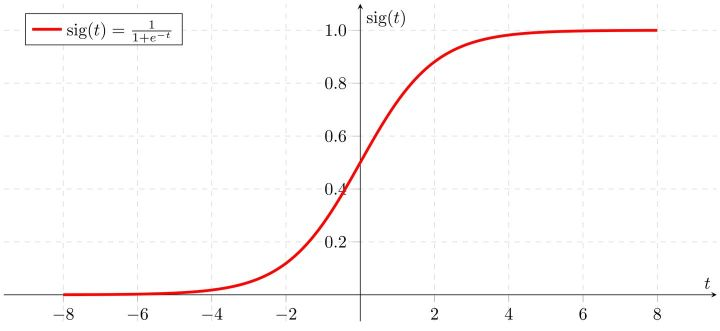

# 逻辑斯蒂回归

## 1. 逻辑斯蒂回归的简介

### 1.1 从感知机到逻辑斯蒂回归

在感知机中，我们知道一个分离超平面 $$wx$$ 将特征空间分成两个部分，样本在不同的子空间中则被分为相对应的类。但是感知机的一个问题在于，我们仅能知道这个样本被分类的结果，但不知道它属于一个类的概率是多少。&#x20;

换句话说，样本在特征空间中的位置可能与分离超平面距离非常近，也有可能非常远，如果距离较远，那么它更有可能被分成它所在一侧对应的类，但是如果与超平面的距离非常近，说明它被分成另一类的可能性也很大，比如被分成A的可能性为51%，而分成B类的可能性为49%，此时线性回归会将其分为A类，而忽略了49%分成B类的可能性：

<figure><figcaption></figcaption></figure>

于是，为了得到这一概率，我们引入了 Sigmoid 函数：

$$
\\sigmoid (x)=\frac{1}{1+e^{-x}}
$$

​

<figure><figcaption></figcaption></figure>

Sigmoid 函数能够将感知机的预测值(-∞，+∞)转换到概率的(0,1)区间，这样，就可以显示一个样本被分为一个类的概率是多少了（引入问题：为什么经过 Sigmoid 函数转换后得到的值，就可以认为是概率？请看1.3）：

$$
P=sigmoid(wx)=\frac{1}{1+e^{-wx}} \\
$$

比如我们认为A类为正类，B类为负类，那么当某个样品分为A类的概率>50%，我们可认为其为A类，如果<50%，我们可认为其为B类（引入问题：为什么要用0.5作为分类阈值？请看1.4）：

$$
\hat y = \left\{ \begin{array}{} 1, &P>0.5 \\ 0, &P < 0.5  \end{array} \right\}\\
$$

​知道概率的好处是什么呢？现实中我们很可能遇到这样一种情况，就是要得到最有可能被分到A类的前10个样本，以对用户进行推荐，这样我们只需要对模型的结果进行排序，就可以解决这个问题。

